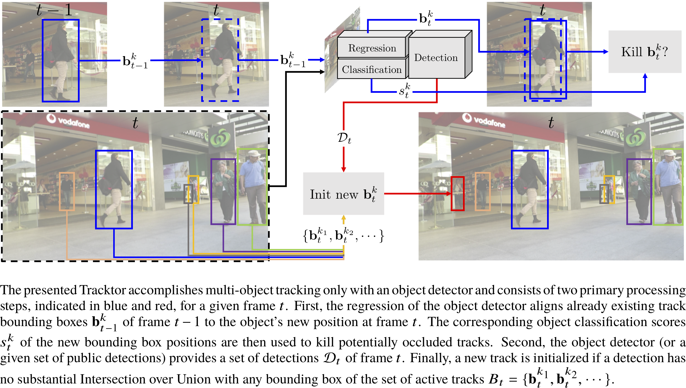

# Tracking without bells and whistles

This repository provides the implementation of our paper **Tracking without bells and whistles** (Philipp Bergmann, [Tim Meinhardt](https://dvl.in.tum.de/team/meinhardt/), [Laura Leal-Taixe](https://dvl.in.tum.de/team/lealtaixe/)) [https://arxiv.org/abs/1903.05625]. This branch includes an updated version of Tracktor for PyTorch 1.X with an improved object detector. The original results of the paper were produced with the code in the `iccv_19` branch.

In addition to our supplementary document, we provide an illustrative [web-video-collection](https://vision.in.tum.de/webshare/u/meinhard/tracking_wo_bnw-supp_video_collection.zip). The collection includes examplary Tracktor++ tracking results and multiple video examples to accompany our analysis of state-of-the-art tracking methods.



## Experiments with fine-tuning

To run the experiment for classification go to the branch reproduce-classification and run the command

  ```
  python experiments/scripts/finetune_tacktor.py with cfg_classification
  ```

To run the experiment for regression go to the branch reproduce-regression and run the command

  ```
  python experiments/scripts/finetune_tacktor.py with cfg_regression
  python experiments/scripts/finetune_tacktor.py with cfg_regression_collect_training_set
  ```

## Installation

1. Clone and enter this repository:
  ```
  git clone https://github.com/phil-bergmann/tracking_wo_bnw
  cd tracking_wo_bnw
  ```

2. Install packages for Python 3.7 in [virtualenv](https://uoa-eresearch.github.io/eresearch-cookbook/recipe/2014/11/26/python-virtual-env/):
    1. `pip3 install -r requirements.txt`
    2. Install Tracktor: `pip3 install -e .`

3. MOTChallenge data:
    1. Download [MOT17Det](https://motchallenge.net/data/MOT17Det.zip), [MOT16Labels](https://motchallenge.net/data/MOT16Labels.zip), [2DMOT2015](https://motchallenge.net/data/2DMOT2015.zip), [MOT16-det-dpm-raw](https://motchallenge.net/data/MOT16-det-dpm-raw.zip) and [MOT17Labels](https://motchallenge.net/data/MOT17Labels.zip) and place them in the `data` folder. As the images are the same for MOT17Det, MOT17 and MOT16 we only need one set of images for all three benchmarks.
    2. Unzip all the data by executing:
    ```
    unzip -d MOT17Det MOT17Det.zip
    unzip -d MOT16Labels MOT16Labels.zip
    unzip -d 2DMOT2015 2DMOT2015.zip
    unzip -d MOT16-det-dpm-raw MOT16-det-dpm-raw.zip
    unzip -d MOT17Labels MOT17Labels.zip
    ```

4. Download object detector and re-identifiaction Siamese network weights and MOTChallenge result files:
    1. Download zip file from [here](https://vision.in.tum.de/webshare/u/meinhard/tracking_wo_bnw-output_v2.zip).
    2. Extract in `output` directory.

## Evaluate Tracktor
In order to configure, organize, log and reproduce our computational experiments we structured our code with the [Sacred](http://sacred.readthedocs.io/en/latest/index.html) framework. For a detailed explanation of the Sacred interface please read its documentation.

1. Tracktor can be configured by changing the corresponding `experiments/cfgs/tracktor.yaml` config file. The default configuration runs Tracktor++ with the FPN object detector as described in the paper.

2. The default configuration is `Tracktor++`. Run `Tracktor++` by executing:

  ```
  python experiments/scripts/test_tracktor.py
  ```

3. The results are logged in the corresponding `output` directory.

For reproducability, we provide the new result metrics of this updated code base on the `MOT17` challenge. It should be noted, that these surpass the original Tracktor results. This is due to the newly trained object detector. This version of Tracktor does not differ conceptually from the original ICCV 2019 version (see branch `iccv_19`). The train and test results are:

```
********************* MOT17 TRAIN Results *********************
IDF1  IDP  IDR| Rcll  Prcn   FAR|   GT  MT   PT   ML|    FP    FN   IDs    FM|  MOTA  MOTP MOTAL
65.2 83.8 53.3| 63.1  99.2  0.11| 1638 550  714  374|  1732124291   903  1258|  62.3  89.6  62.6

********************* MOT17 TEST Results *********************
IDF1  IDP  IDR| Rcll  Prcn   FAR|   GT  MT   PT   ML|    FP    FN   IDs    FM|  MOTA  MOTP MOTAL
55.1 73.6 44.1| 58.3  97.4  0.50| 2355 498 1026  831|  8866235449  1987  3763|  56.3  78.8  56.7
```

## Train and test object detector (Faster-RCNN with FPN)

For the object detector we followed the new native `torchvision` implementations of Faster-RCNN with FPN which are pretrained on COCO. The provided object detection model was trained and tested with [this](https://colab.research.google.com/drive/1_arNo-81SnqfbdtAhb3TBSU5H0JXQ0_1) Google Colab notebook. The `MOT17Det` train and test results are:

```
********************* MOT17Det TRAIN Results ***********
Average Precision: 0.9090
Rcll  Prcn|  FAR     GT     TP     FP     FN| MODA  MODP
97.9  93.8| 0.81  66393  64989   4330   1404| 91.4  87.4

********************* MOT17Det TEST Results ***********
Average Precision: 0.8150
Rcll  Prcn|  FAR     GT     TP     FP     FN| MODA  MODP
86.5  88.3| 2.23 114564  99132  13184  15432| 75.0  78.3
```

## Training the reidentifaction model

1. The training config file is located at `experiments/cfgs/reid.yaml`.

2. Start training by executing:
  ```
  python experiments/scripts/train_reid.py
  ```

## Publication
 If you use this software in your research, please cite our publication:

```
  @InProceedings{tracktor_2019_ICCV,
  author = {Bergmann, Philipp and Meinhardt, Tim and Leal{-}Taix{\'{e}}}, Laura},
  title = {Tracking Without Bells and Whistles},
  booktitle = {The IEEE International Conference on Computer Vision (ICCV)},
  month = {October},
  year = {2019}}
```
